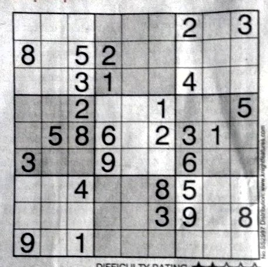
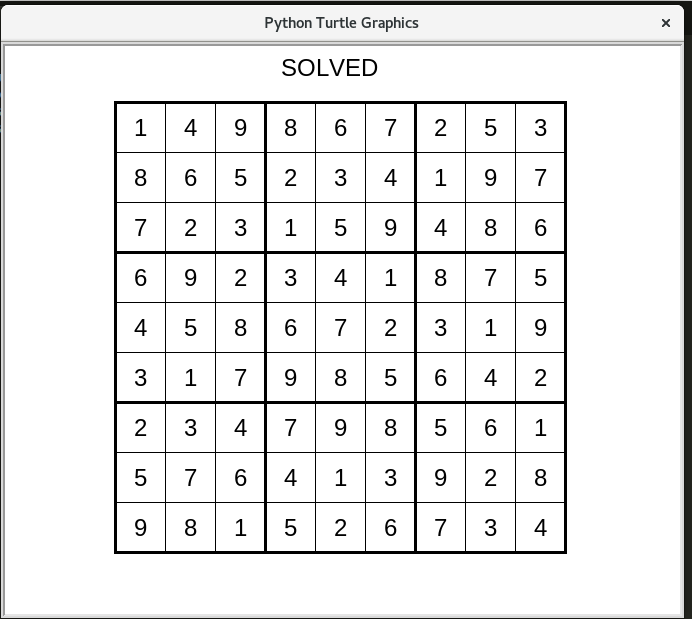

# Sudoku_Solver

A rudimentary sudoku solver, that generates the results of the puzzle, given the image of a sudoku puzzle. The tolerance to skew is minimal, and highly skewed images or images with lack of clarity, require manual entry of the puzzle.


## Installation

1. Clone the repo
   ```sh
   git clone https://github.com/yashYRS/Sudoku_Solver.git
   ```
2. Install virtualenv
   ```sh
   python3 -m pip install --user virtualenv
   ```
3. Make a virtual Environnment and activate it
   ```sh
   virtualenv /path_to_env
   source /path_to_env/bin/activate
   ```
5. Install the requirements
   ```sh
   pip install -r requirements.txt 
   ```


## Usage

There are 2 arguments that need to be passed, while running the main script
- puzzle : Denotes the path to the image, that needs to be processed
- model_path : Denotes the path at which the model has been stored/ needs to be stored
It should be noted that, if the script is run for the 1st time, then the model for digit recognition starts training, and the puzzle is processed, only after the training is complete. After training is complete, the model is saved, and reused for all future puzzles that are given as input.

```sh
python sudoku.py --puzzle sample.jpg --model_path 'model.pt'
```

In case the sudoku image given cannot be processed, a prompt on the terminal, asks for manual entry of the puzzle. The format for entering the puzzle is as follows
- Provide 0 for empty cells
- All cells with values are provided as is.
- Separate column values by a space
```sh
Enter row 1: 9 0 0 0 8 3 0 5 4 
```

## Screenshots from the application

### Input_image - 

   
### Solution Displayed -

   
