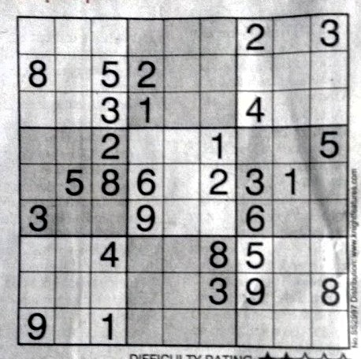
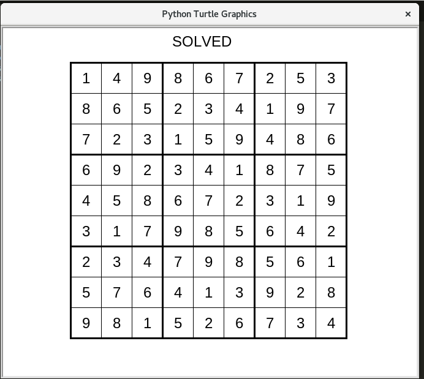

# Sudoku_Solver

Steps For Using the application : 
  1. Make the digit recognition model - make_model.py
  2. Run the sudoku.py script
  3. Enter path to the sudoku image on prompt 
  4. If lines detected - 20 and points detected - 100, and the sudoku entered is valid, Solution displayed 
  5. Else, the sudoku has to be entered at command line, and the solution will be displayed. 
  
   ## Input_image - 
   
   
   ## Solution Displayed -

   
